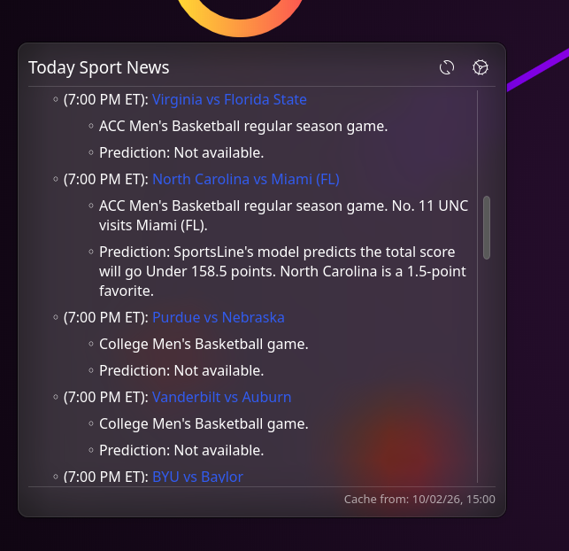
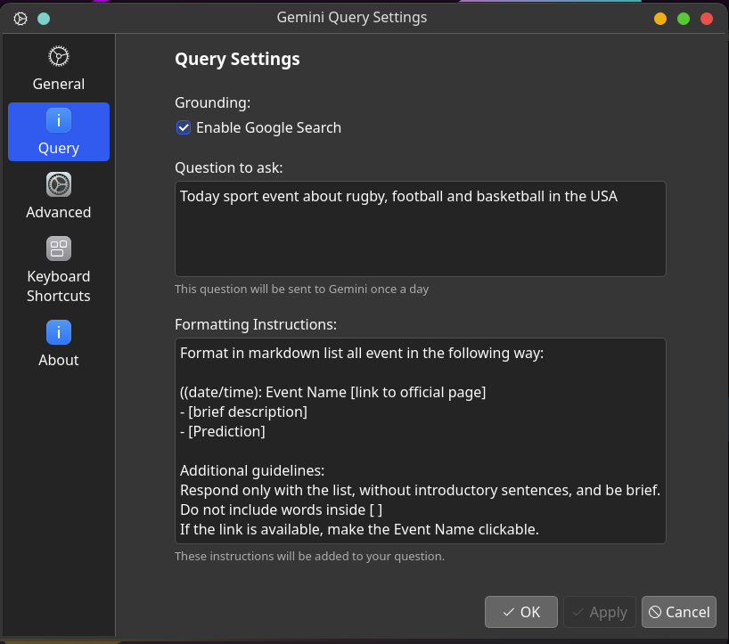
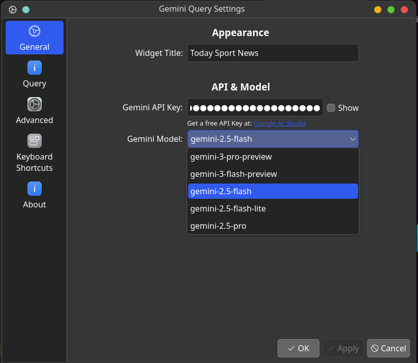

# AI Query Widget

**AI Query** is a lightweight KDE Plasma 6 widget that brings the power of multiple AI providers directly to your desktop. Designed for daily insights, motivational quotes, or quick technical facts, it performs recurring queries and keeps the results beautifully rendered on your panel or desktop.

 

## 🚀 Installation

1. Download [last release](https://github.com/postadelmaga/plasmoid-geminiQuery/releases/latest/download/Ai-Query.plasmoid) and run `kpackagetool6 -t Plasma/Applet -i Ai-Query.plasmoid`
2. Choose your AI provider:
   - **Google**: Obtain a free API Key from [Google AI Studio](https://aistudio.google.com/app/apikey)
   - **OpenRouter**: Get your API Key from [OpenRouter Settings](https://openrouter.ai/settings/keys)
3. Configure your desired question and select your preferred model.
4. Enjoy your AI-powered desktop!

## ✨ Features

- **🔄 Multi-Provider Support**: Choose between Google Gemini and OpenRouter with a simple dropdown
- **🆓 Free OpenRouter Models**: Access to 15+ free AI models including:
  - DeepSeek R1 series (reasoning models)
  - Meta Llama 3.3 70B Instruct
  - Qwen3 Coder 480B (coding specialist)
  - NVIDIA Nemotron series
  - And many more!
- **Latest Google Models**: Select from Gemini 2.5 and Gemini 3 Preview series
- **Rich Markdown Rendering**: Responses are rendered with full Markdown support, including headers, bold text, lists, and clickable links
- **Google Search Grounding**: Enable Google Search in settings to allow Gemini to provide up-to-date information by searching the web (Google provider only)
- **Customizable Experience**: 
  - add instruction to format your response
- **Responsive Design**: Clean, modern interface that fits perfectly with the Breeze theme
- **💾 Smart Caching System**: Efficient local caching (daily) system designed to save your API quota and provide instant responses

---

**Developed with 🤖 Antigravity by Gemini.**
This project was implemented entirely using agentic AI technology to ensure high-quality code and modern design standards.
